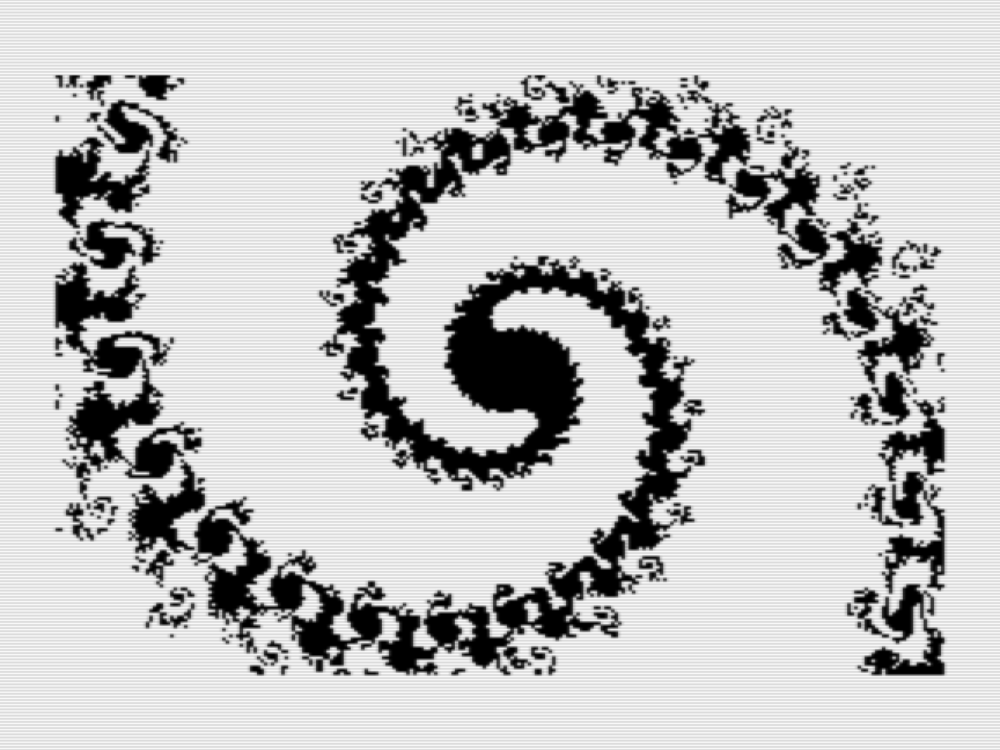
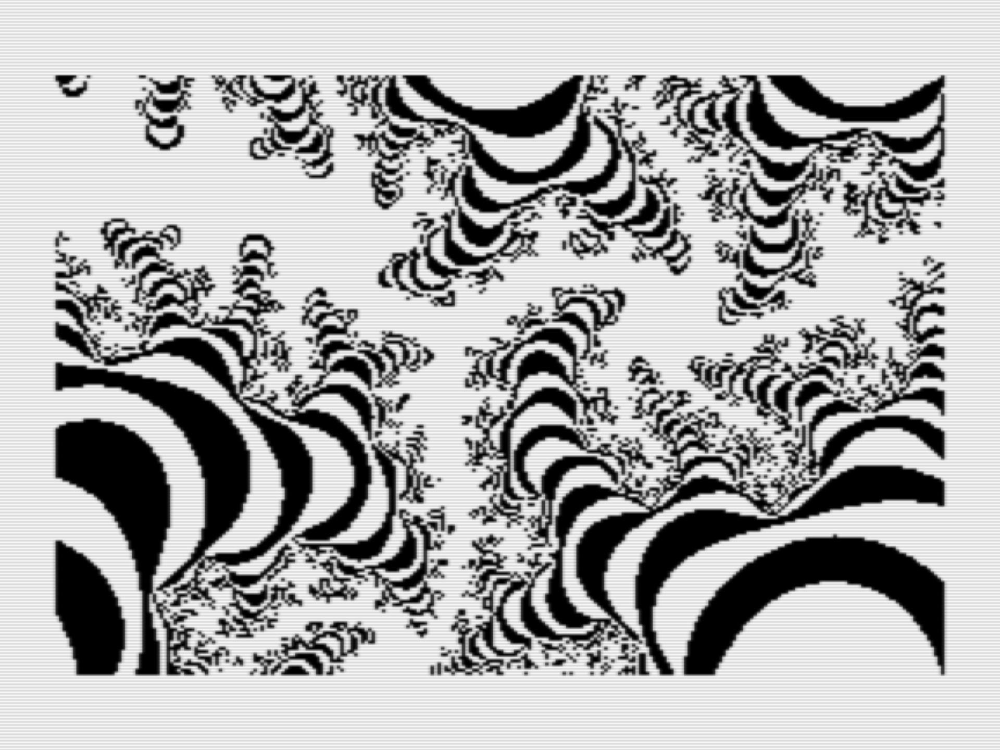
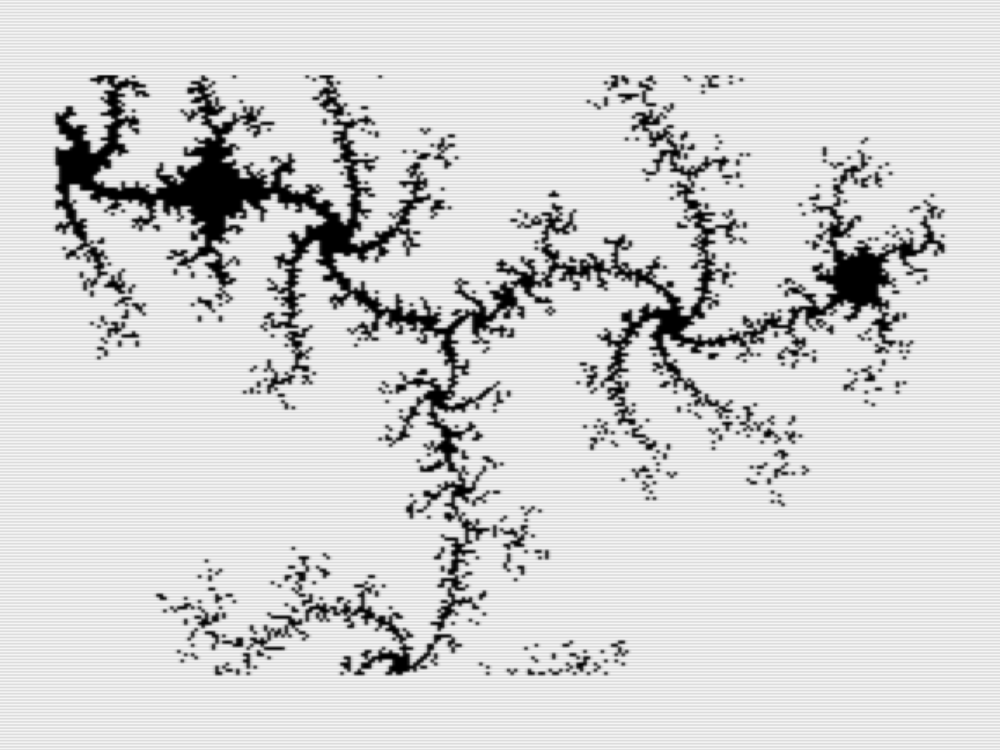
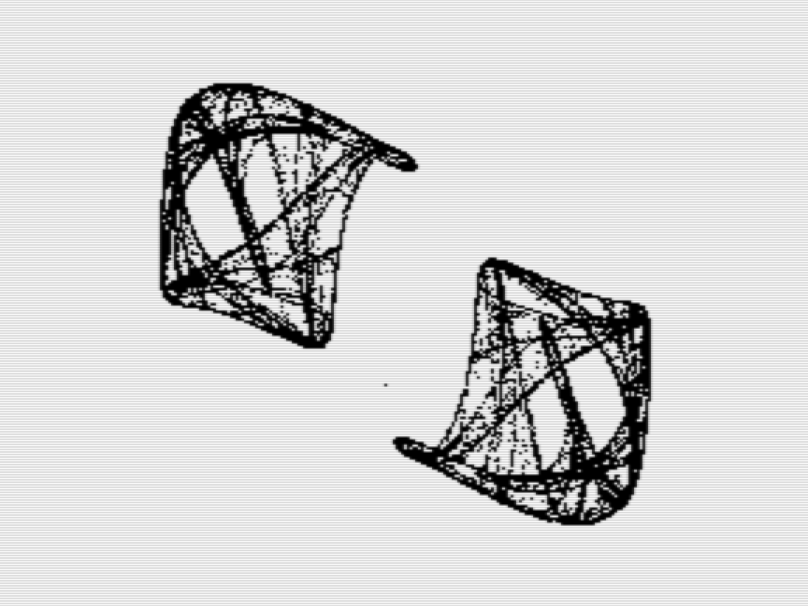
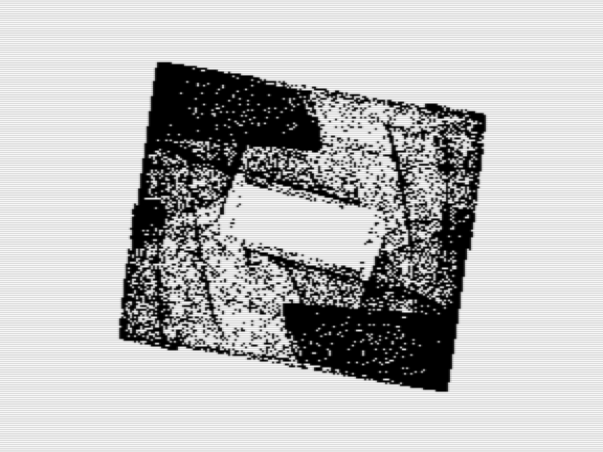
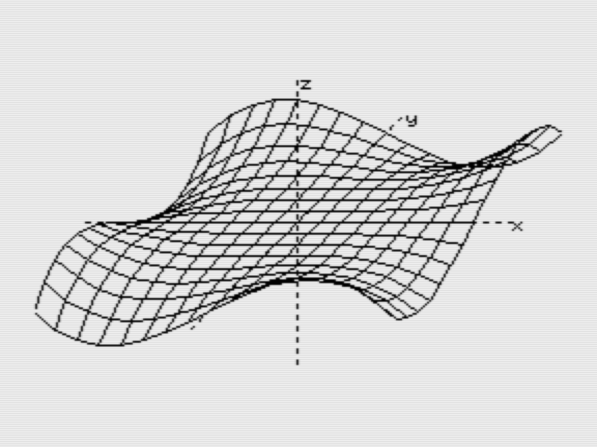
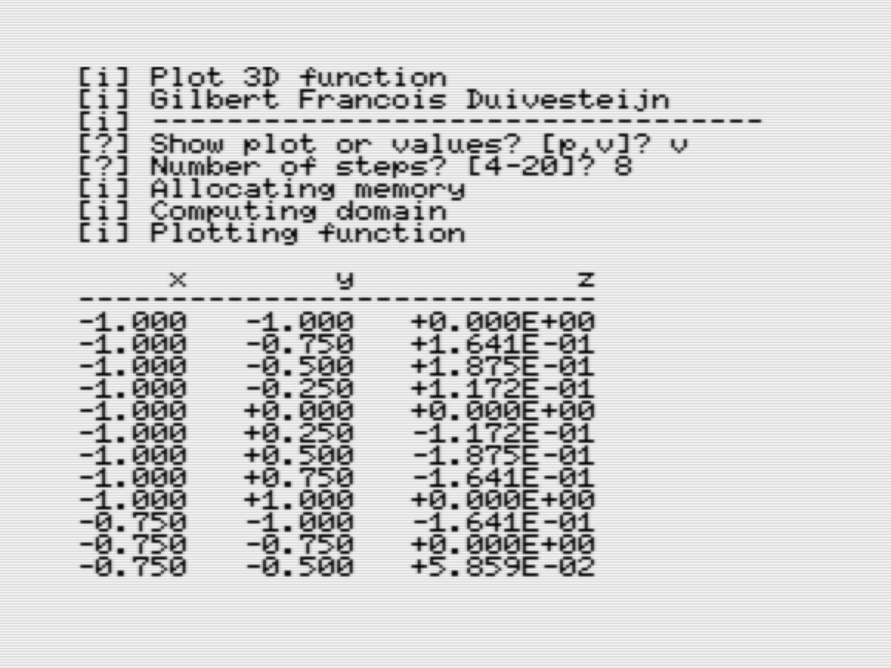
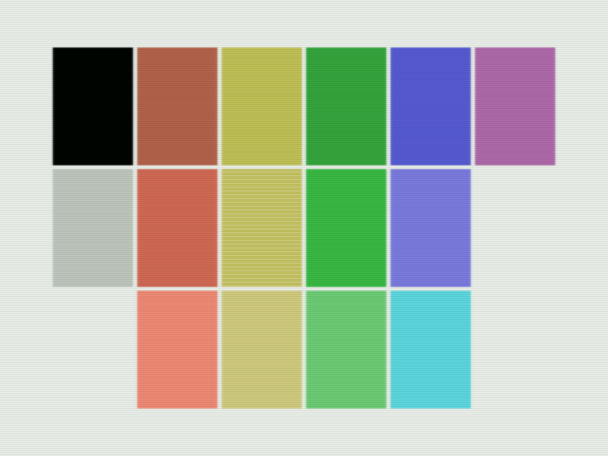
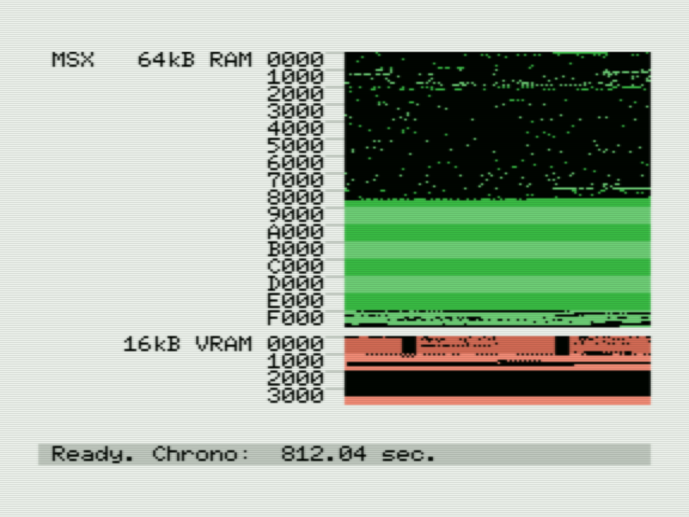
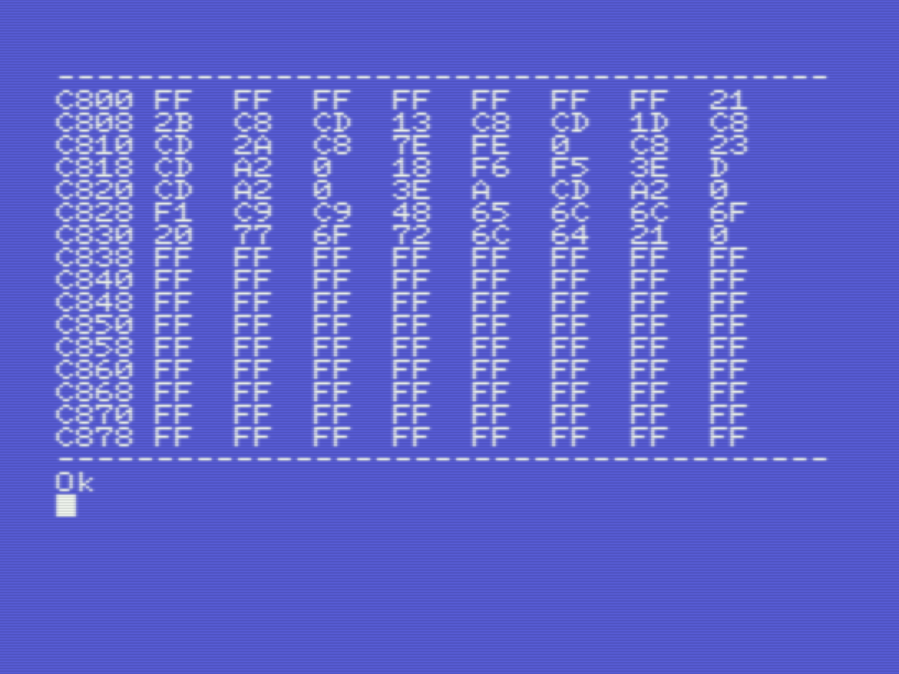

# MSX

*Gilbert François Duivesteijn*

- [MSX](#msx)
  * [Abstract](#abstract)
  * [The art of mathematics](#the-art-of-mathematics)
    + [Mandelbrot](#mandelbrot)
    + [Strange Attractors](#strange-attractors)
    + [3D Plot](#3d-plot)
  * [Graphics](#graphics)
    + [Palette](#palette)
    + [Screen 2 dump to data recorder](#screen-2-dump-to-data-recorder)
  * [Assembly](#assembly)
    + [TUTORIAL: Writing and debugging assembly on a real MSX computer](#tutorial--writing-and-debugging-assembly-on-a-real-msx-computer)
    + [Memory Visualizers](#memory-visualizers)


## Abstract

Around 1986, when I was in 2nd grade of Gymnasium, I bought a Canon V-20 MSX computer and I loved it. I remember that for that time, buying it from own saved pocket money, it was an expensive computer. Most of the time I was programming all kinds of little experiments in MSX Basic and later in assembly, using Champ ASM which I bought on cassette. The MSX computer was capable of creating nice color graphics, but I had it connected to a B&W TV, and because of that, I didn't care about the colours so much.

Since there was no such thing as Github back then, I wrote the code down in a notebook (pen and paper!). Only later, I got a cassette recorder and saved the programs on tape. Now, > 35 years later,  the tapes are lost and I didn't have this computer anymore. However, in july 2021, luck was on my side and I found on eBay a Canon V-20 in mint condition. Amazing! I bought it and I started to type in some of the programs from the old notebook and put them in Git for conservation and most of all, for fun. 


## The art of mathematics

### Mandelbrot

[fractal.bas](./src/basic/fractal.bas) The complex function 

```
zn = z^2 + c
```
is tested for every point within the domain. When after a finite amount of iterations the value `z` goes to infinity, the value is outside the Mandelbrot set. If the value stays `||z|| < 2`then the value is inside the Mandelbrot set. Nowadays, these fractals can be rendered super fast with millions of colours. In 1987, on the MSX, I made a monochrome implementation, using 2 options: either make a zebra pattern by taking the mod of the "n-iterations to escape", or slice the n-iterations value and plot it as in- or outside the set. The zebra pattern works best for zoomed out views, the clipping pattern works best on zoomed in areas.

|                                                              |                                                              |
| :----------------------------------------------------------: | ------------------------------------------------------------ |
|                         |                         |
| Mandelbrot set with (xc, yc)=(-0.5, 0), size=2.0, depth=16, colormap=zebra. | Mandelbrot with (xc, yc)=(-0.7792, 0.1345), size=7.984e-4, depth=128, colormap=clip. |
|                         |                         |
| Mandelbrot with (xc, yc)=(-0.4781, -0.6311), size=2.441e-3, depth=48, colormap=zebra. | Mandelbrot with (xc, yc)=(-0.4781, -0.6311), size=2.441e-3, depth=64, colormap=clip. |

### Strange Attractors

[attrac.bas](./src/basic/attrac.bas) In the mathematical field of dynamical systems, an attractor is a set of states toward which a system tends to evolve,[2] for a wide variety of starting conditions of the system. System values that get close enough to the attractor values remain close even if slightly disturbed. In this program, art is generated by a system of 2 simple formulas:

```
xn = sin(by) + c sin(bx)
yn = sin(ax) + d sin(ay)
```

Then after taking an initial (x,y) coordinate, the new points are computed by repeating the formulas over and over again. The parameters a, b, c and d are chosen randomly. However, finding a combination of these parameters that result in a nice looking plot can be tricky. In many cases the combination of parameters results in a plot of only a few pixels.

|                                      |                                      |
| ------------------------------------ | ------------------------------------ |
|  |  |
|  |  |
|                                      |                                      |

### 3D Plot

[plot3d.bas](./src/basic/plot3d.bas) plotting program to visualize 3D plots `f(x, y) = z`. To change the input function and domain, edit the first lines of the code.

|                                              |                                              |
| :------------------------------------------- | :------------------------------------------- |
|  |  |
| Plot view of function $f(x,y)=x^3y-y^3x$     | Values view                                  |


## Graphics

### Palette

[palette.bas](./src/basic/palette.bas) This program shows the 15 MSX(1) colors on screen 2. I always found the default sorting of the colours quite odd. I tried to order them in a more logical way. The tones of the colors in the palette are different on an MSX and MSX2. Note that yellow has only 2 tones. To simulate the medium tone of yellow, the color patch is an interlaced representation of color 10 and 11. *(Screenshots made with openMSX)*

|                                                             |                                                              |
| ----------------------------------------------------------- | ------------------------------------------------------------ |
|  |  |
| Canon V-20 MSX                                              | Sony HB-700P MSX2                                            |

|  B/W |  Red |  Yellow | Green | Blue | Magenta |
| ---: | ---: | ------: | ----: | ---: | ------: |
|    1 |    6 |      10 |    12 |    4 |      13 |
|   14 |    8 | (10/11) |     2 |    5 |         |
|   15 |    9 |      11 |     3 |    7 |         |


### Screen 2 dump to data recorder

On an MSX2 with floppy drive, it is easy to dump the screen with the `bsave "filename",s` command. But on an MSX1 with a cassette data recorder, it is not so easy. The `,s` option on `bload/bsave` is not yet supported on MSX1. The only way to store the state of the screen is to copy the VRAM into RAM first and then use `bsave` to store it on cassette. 

[s2dumpv1.bas](./src/basic/s2dumpv1.bas) This method works only on MSX2 computers with floppy drives.

[s2dumpv2.bas](./src/basic/s2dumpv2.bas) This method works on MSX1 computers with cassette data recorders. The program is written in pure basic and easy to understand. However, copying the VRAM to RAM and vice versa is very slow, around 120 seconds.

[s2dumpv3.bas](./src/basic/s2dumpv3.bas) This method works on MSX1 computers with cassette data recorders. The program is written in MSX-Basic and assembly. Copying from VRAM to RAM or RAM to VRAM takes about 0.2 (!) seconds, over 600x faster than the pure MSX-Basic version.


## Assembly

### TUTORIAL: Writing and debugging assembly on a real MSX computer

Nowadays we are spoiled with cross compilers and fast computers. However, it is still fun to write assembly code on a real msx computer. Click on the link below for a tutorial on how to use the assembler Champ and see how I programmed in assembly in the 80s! Champ is fantastic, since it is a assembler, editor, debugger and monitor all in one. Moreover, it allows the developer to switch between the development environment and basic interpreter.

[TUTORIAL: Writing and debugging Assembly for MSX with Champ](WritingASM.md)

### Memory Visualizers

[memory.bas](./src/basic/memory.bas) I made this program in 1988 to get a better understanding of the used memory of my Canon V-20. The program is expected to work well on any MSX with 64kB RAM. If you have another configuration, some parameters have to be adapted. The program is not efficient in terms of speed.

|                                                              |
| ------------------------------------------------------------ |
|                              |
| Memory viewer for MSX(1), showing the memory usage of a Canon V-20. |

[memmon.bas](./src/basic/memmon.bas) Memmon is a very simple memory monitor, written in basic. It asks for the start address and shows the memory content of the following 128 bytes. I developed this program to help me with finding the last used address in my compiled assembly programs, needed for saving the binary data to cassette.
|                                              |                                              |
| -------------------------------------------- | -------------------------------------------- |
|  |  |
| Simple Memory Monitor, screen 1              | Simple Memory Monitor, screen 2              |


