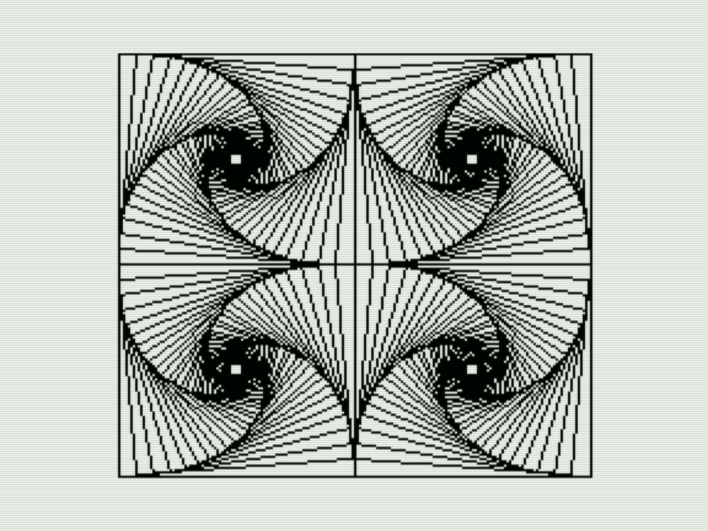
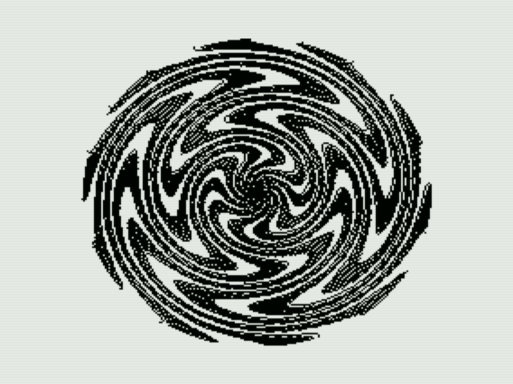
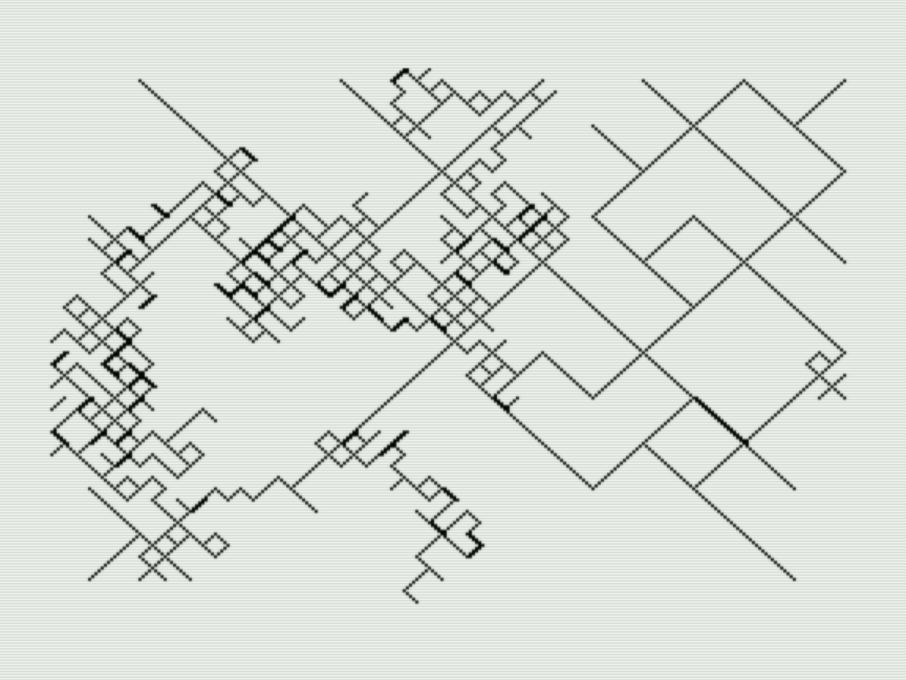
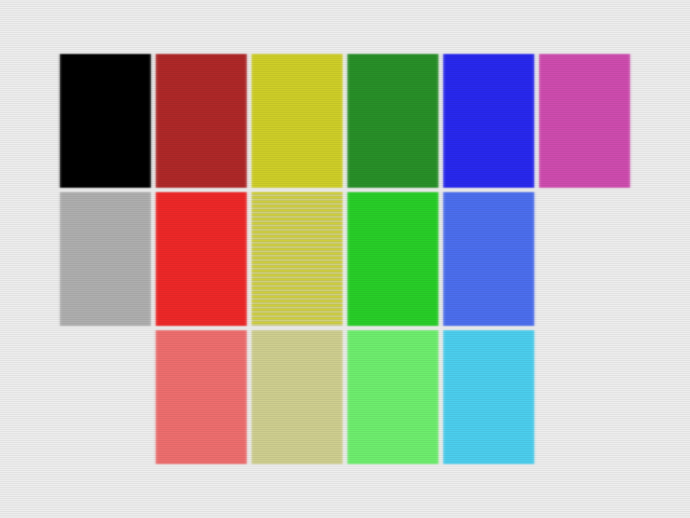
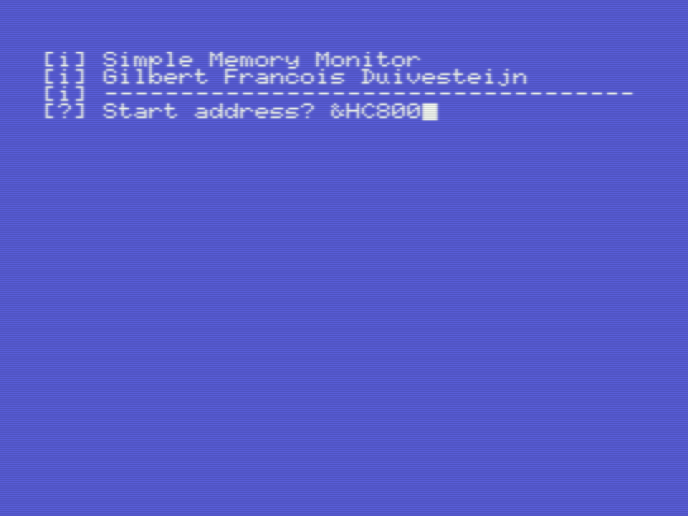
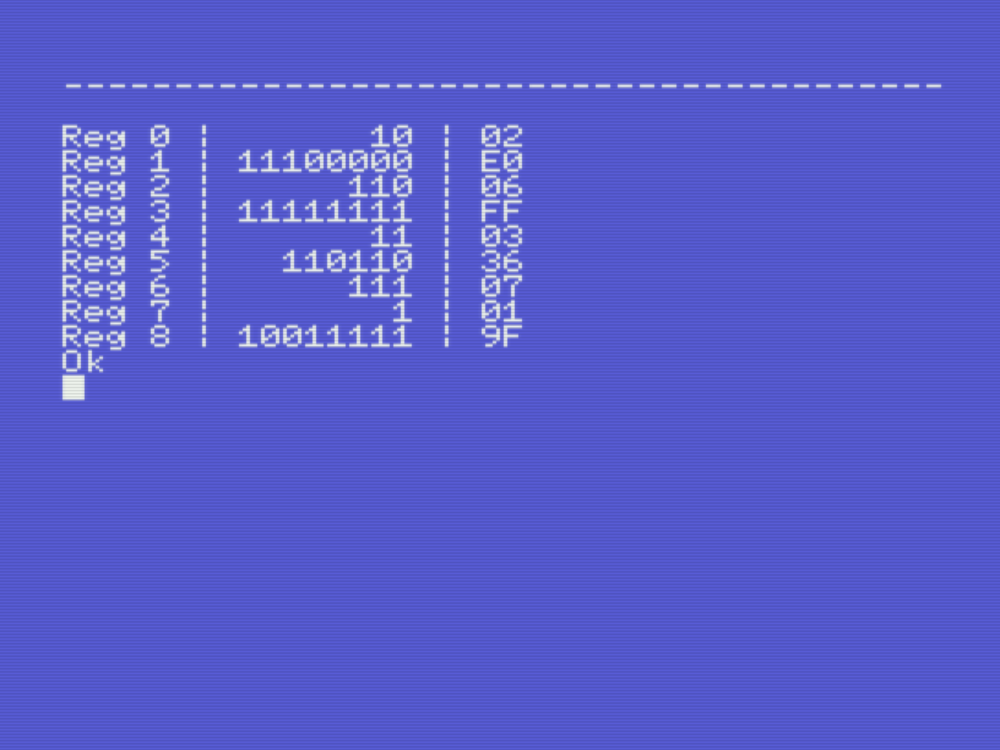

# MSX

_Gilbert François Duivesteijn_

## Abstract

Around 1986, when I was in 2nd grade of Gymnasium, I bought a Canon V-20 MSX computer and I loved it. I remember that for that time, buying it from own saved pocket money, it was an expensive computer. Most of the time I was programming all kinds of little experiments in MSX Basic and later in assembly, using Champ ASM which I bought on cassette. The MSX computer was capable of creating nice color graphics, but I had it connected to a B&W TV, and because of that, I didn't care about the colours so much.

Since there was no such thing as Github back then, I wrote the code down in a notebook (pen and paper!). Only later, I got a cassette recorder and saved the programs on tape. Now, > 35 years later, the tapes are lost and I didn't have this computer anymore. However, in july 2021, I started to type in some of the programs from the old notebook and put them in Git for conservation and most of all, for fun.

Please visit also my other MSX page: [Journey into MSX Z80 Assembly programming](https://gilbertfrancois.github.io)

## The art of mathematics

### Mandelbrot

[fractal.bas](src/basic/fractal.bas) The complex function

$$z_n = z^2 + c$$

is tested for every point within the domain. When after a finite amount of iterations the value $z$ goes to infinity, the value is outside the Mandelbrot set. If the value stays $||z|| < 2$ then the value is inside the Mandelbrot set. Nowadays, these fractals can be rendered super fast with millions of colours. In 1987, on the MSX, I made a monochrome implementation, using 2 options: either make a zebra pattern by taking the mod of the $n$-iterations to escape, or slice the $n$-iterations value and plot it as in- or outside the set. The zebra pattern works best for zoomed out views, the clipping pattern works best on zoomed in areas.

|  |  |
| ----------------------------------------------- | ----------------------------------------------- |
| Mandelbrot figure 1                             | Mandelbrot figure 2                             |
|  |  |
| Mandelbrot figure 3                             | Mandelbrot figure 4                             |

Parameters:

Mandelbrot figure 1: $(x_c, y_c)=(-0.5000,  +0.0000)$, size=2.0, depth=16, colormap=zebra. 
Mandelbrot figure 2: $(x_c, y_c)=(-0.7792,  +0.1345)$, size=7.984e-4, depth=128, colormap=clip. 
Mandelbrot figure 3: $(x_c, y_c)=(-0.4781, -0.6311)$, size=2.441e-3, depth=48, colormap=zebra. 
Mandelbrot figure 4: $(x_c, y_c)=(-0.4781, -0.6311)$, size=2.441e-3, depth=64, colormap=clip. 

### Strange Attractors

[attrac.bas](src/basic/attrac.bas) In the mathematical field of dynamical systems, an attractor is a set of states toward which a system tends to evolve,[2] for a wide variety of starting conditions of the system. System values that get close enough to the attractor values remain close even if slightly disturbed. In this program, art is generated by a system of 2 simple formulas:

$$
\begin{align}
x_n &= \sin(by) + c \cdot \sin(bx)\\
y_n &= \sin(ax) + d \cdot \sin(ay)\\
\end{align}
$$

Then after taking an initial $(x,y)$ coordinate, the new points are computed by repeating the formulas over and over again. The parameters $a$, $b$, $c$ and $d$ are chosen randomly. However, finding a combination of these parameters that result in a nice looking plot can be tricky. In many cases the combination of parameters results in a plot of only a few pixels.

|  |  |
| ------------------------------------------- | ------------------------------------------- |

|  |  |  |
| ------------------------------------------- | ------------------------------------------- | ------------------------------------------- |
|  |  |  |

### Fluid Flow Simulation

[flow.bas](src/basic/flow.bas) I was always intreaged by fluid flow simulations. However, solving the Navier-Stokes equations on a MSX with given computational power and memory limitations is not really feasible, even if you let the computer run for several days. However, you can still get decent flow-like looking images, using perlin noise. This technique is mainly used in the game industry to get fluid flow like behavior with the least amount of computational cost. I've made my own implementation of perlin noise, which I use in this code. To speed-up the computations on the MSX even more, I'm using lookup tables for sin() and cos() operators.

|  |  |
| --------------------------------- | --------------------------------- |
|  |  |
|  |  |

### Stream lines

[streamln.bas](src/basic/streamln.bas) Another variation of showing pseudo flows is to integrate a vector field. I used again my own implementation of the perlin noise, like in the flow.bas code. Then, from a given point in the flow field, I follow the flow upstream and downstream until it goes out of the computational domain.

|  |  |
| ------------------------------------------------- | ------------------------------------------------- |

|  |  |  |
| ------------------------------------------------- | -------------------------------------------------- | -------------------------------------------------- |

### Vector fields

[vecfield.bas](src/basic/vecfield.bas) The vector field code visualises the output of [libnoise.bas](src/basic/libnoise.bas), my own implementation of the perlin noise, as described in: _Perlin, Ken_ (July 1985). "An Image Synthesizer". _SIGGRAPH Comput. Graph_. **19** (97–8930): 287–296. [10.1145/325165.325247](https://doi.org/10.1145%2F325165.325247). A reference implementation with verification and validation is available in this repository:

[gilbertfrancois/partial-differential-equations/notebook/Perlin noise.ipynb](https://github.com/gilbertfrancois/partial-differential-equations/blob/7a5a9f7d42f8695e5dcff719a41bc208d1bcea20/notebook/Perlin%20noise.ipynb)

|  |  |
| -------------------------------------------- | -------------------------------------------- |

### Sketches

A collection of small sketches, made in Basic.

|               |             |
| ------------------------------------------------- | ------------------------------------------------- |
| [squares.bas](src/basic/squares.bas)              | [barcode.bas](src/basic/barcode.bas)              |
|              |                   |
| [spiders.bas](src/basic/spiders.bas)              | [dots1.bas](src/basic/dots1.bas)                  |
|                 |                    |
| [phyllo.bas](src/basic/phyllo.bas)                | [spirals1.bas](src/basic/spirals1.bas)            |
|                |              |
| [groovy.bas](src/basic/groovy.bas)                | [rainbow.bas](src/basic/rainbow.bas)              |
|  |  |
| [rndwalk1.bas](src/basic/rndwalk1.bas)            | [rndwalk2.bas](src/basic/rndwalk2.bas)            |
|        |               |
| [fibonacc.bas](src/basic/fibonacc.bas)            | [blocks1.bas](src/basic/blocks1.bas)              |

### 2D Plot

[plot2d.bas](src/basic/plot2d.bas) plotting program to visualize 2D plots $f(x) = y$. To change the input function and domain, edit the first lines of the code.

|  |  |
| :---------------------------------------- | :---------------------------------------- |
| Plot view                                 | Values view                               |

Plot view of function $f(x)=e^{-x}-\frac{1}{4} e^{-2x}$

### 3D Plot

[plot3d.bas](src/basic/plot3d.bas) plotting program to visualize 3D plots $f(x, y) = z$. To change the input function and domain, edit the first lines of the code.

|  |  |
| :---------------------------------------- | :---------------------------------------- |
| Plot view                                 | Values view                               |

Plot view of function $f(x,y)=x^3y-y^3x$

## Graphics

### Palette

[palette.bas](src/basic/palette.bas) This program shows the 15 MSX(1) colors on screen 2. I always found the default sorting of the colours quite odd. I tried to order them in a more logical way. The tones of the colors in the palette are different on an MSX and MSX2. Note that yellow has only 2 tones. To simulate the medium tone of yellow, the color patch is an interlaced representation of color 10 and 11. _(Screenshots made with openMSX)_

|  |  |
| --------------------------------------------------------- | ------------------------------------------------------------- |
| Canon V-20 MSX                                            | Sony HB-700P MSX2                                             |

| B/W | Red |  Yellow | Green | Blue | Magenta |
| --: | --: | ------: | ----: | ---: | ------: |
|   1 |   6 |      10 |    12 |    4 |      13 |
|  14 |   8 | (10/11) |     2 |    5 |         |
|  15 |   9 |      11 |     3 |    7 |         |

### Screen 2 dump to data recorder

On an MSX2 with floppy drive, it is easy to dump the screen with the `bsave "filename",s` command. But on an MSX1 with a cassette data recorder, it is not so easy. The `,s` option on `bload/bsave` is not yet supported on MSX1. The only way to store the state of the screen is to copy the VRAM into RAM first and then use `bsave` to store it on cassette.

[s2dumpv1.bas](src/basic/s2dumpv1.bas) This method works only on MSX2 computers with floppy drives.

[s2dumpv2.bas](src/basic/s2dumpv2.bas) This method works on MSX1 computers with cassette data recorders. The program is written in pure basic and easy to understand. However, copying the VRAM to RAM and vice versa is very slow, around 120 seconds.

[s2dumpv3.bas](src/basic/s2dumpv3.bas) This method works on MSX1 computers with cassette data recorders. The program is written in MSX-Basic and assembly. Copying from VRAM to RAM or RAM to VRAM takes about 0.2 (!) seconds, over 600x faster than the pure MSX-Basic version.

## Assembly programming

### TUTORIAL: Writing and debugging assembly on a real MSX computer

Nowadays we are spoiled with cross compilers and fast computers. However, it is still fun to write assembly code on a real msx computer. Click on the link below for a tutorial on how to use the assembler Champ and see how I programmed in assembly in the 80s! Champ is fantastic, since it is a assembler, editor, debugger and monitor all in one. Moreover, it allows the developer to switch between the development environment and basic interpreter.

[Journey into MSX Z80 Assembly programming](https://gilbertfrancois.github.io)

### Nyan Cat

[nyan cat](src/asm/13_nyancat)  Nyan cat forever! This version is made for MSX(1). The music is composed with Arkos Tracker 2, de animation and music player are programmed in assembly. 

### Doom music E1M1

[doom](src/asm/12_doom) Prepare to be transported back in time with this video showcasing a remarkable remake of Doom's iconic E1M1 soundtrack, composed by Robert Prince for ID Software in 1994. Curiosity sparked my imagination as I wondered how this epic composition would sound on an even older system—the MSX. This remake is crafted for the MSX1, utilizing its original 3-channel PSG sound chip, the AY-3-8910, to capture the essence of retro gaming. With Arkos Tracker 2, I composed the music and with my own developed BLiTzBLiT Digitizer software and NEON Cheese for MSX, I created the graphics. The resulting program is made in z80 assembly, assembled with vasm, and can be run on MSX-DOS 1.0 or higher.

### The Matrix

[The Matrix](src/asm/11_matrix) The Matrix digital rain, made for MSX(1) in Z80 assembly code, takes advantage of screen 2 graphics mode since the MSX doesn't support color text mode. It uses a custom character set featuring Latin, Greek, Cyrillic, Katakana, and Hiragana characters, all centered in the middle of the tiles. The program includes many small, cool nerdy features, such as syncing with interrupts to ensure a constant running speed. The green rain trails are designed with three different shades of green, starting with a highlighted head and fading out smoothly at the end. The trails move at random speeds, and some characters are randomly permuted for an extra cool visual effect. I'm very pleased with the result and love pushing the possibilities of 8-bit hardware. 

### Memory Visualizers

[memory.bas](src/basic/memory.bas) I made this program around 1986-1987 to get a better understanding of the used memory of my Canon V-20. The program is expected to work well on any MSX with 64kB RAM. If you have another configuration, some parameters have to be adapted. The program is not efficient in terms of speed.

|                                       |
| ------------------------------------------------------------------- |
| Memory viewer for MSX(1), showing the memory usage of a Canon V-20. |

[memmon.bas](src/basic/memmon.bas) Memmon is a very simple memory monitor, written in basic. It asks for the start address and shows the memory content of the following 128 bytes. I developed this program to help me with finding the last used address in my compiled assembly programs, needed for saving the binary data to cassette.
|  |  |
| -------------------------------------------- | -------------------------------------------- |
| Simple Memory Monitor, screen 1 | Simple Memory Monitor, screen 2 |

### VDP Wizard

This program helps you to find the right register settings for the 99x8 Video Display Processor to set it in de mode of choice.

|  |  |
| ------------------------------------- | ------------------------------------- |
| VDP Wizard: User input                | VDP Wizard: Register settings.        |

