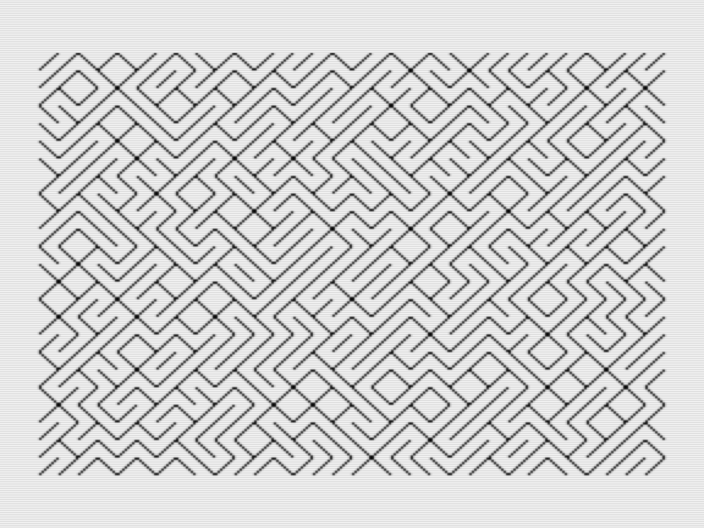

# MSX

*Gilbert François Duivesteijn*

## Abstract

Around 1986, when I was in 2nd grade of Gymnasium, I bought a Canon V-20 MSX computer and I loved it. I remember that for that time, buying it from own saved pocket money, it was an expensive computer. Most of the time I was programming all kinds of little experiments. The MSX computer was capable of creating nice color graphics, but I had it connected to a B&W TV, and because of that, I didn't care about the colours so much.

Since there was no such thing as Github back then, I wrote the code down in a notebook (pen and paper!). Only later, I got a cassette recorder and saved the programs on tape. Now, > 35 years later,  the tapes are lost and I didn't have this computer anymore. However, in july 2021, luck was on my side and I found on eBay a Canon V-20 in mint condition. Amazing! I bought it and I started to type in some of the programs from the old notebook and put them in Git for conservation and most of all, for fun. 

## 3D Plot

**3dplot.bas**: A plotting program to visualize 3D plots $f(x, y) = z$. To change the input function and domain, edit the first lines of the code.

|                                                 |                                                 |
| :---------------------------------------------- | :---------------------------------------------- |
|  |  |
| Plot view of function $f(x,y)=x^3y-y^3x$        | Values view                                     |

## Mandelbrot

**fractal1.bas** The complex function 
$$
z_{n+1} = z_n^2 + c
$$
is tested for every point within the domain. When after a finite amount of iterations the value $z_n$ goes to infinity, the value is outside the Mandelbrot set. If the value stays $||z|| < 2$ then the value is inside the Mandelbrot set. Nowadays, these fractals can be rendered super fast with millions of colours. In 1987, on the MSX, I made a monochrome implementation, using 2 options: either make a zebra pattern by taking the mod of the "n-iterations to escape", or slice the n-iterations value and plot it as in- or outside the set. The zebra pattern works best for zoomed out views, the in-out pattern works best on zoomed in areas.

|                                                              |
| :----------------------------------------------------------: |
|  |
| Mandelbrot set with $(x_c,y_c)=(-0.5, 0)$ and $size=2$. Visualized with zebra pattern. |

## Maze

**vpoke1.bas** An experiment where the video memory is directly accessed and written with the vpoke command.

|                                                 |
| ----------------------------------------------- |
|  |
| Maze                                            |

