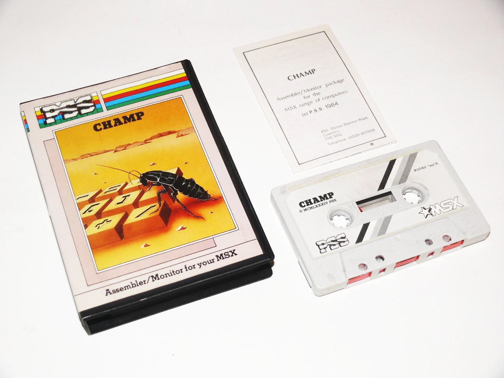
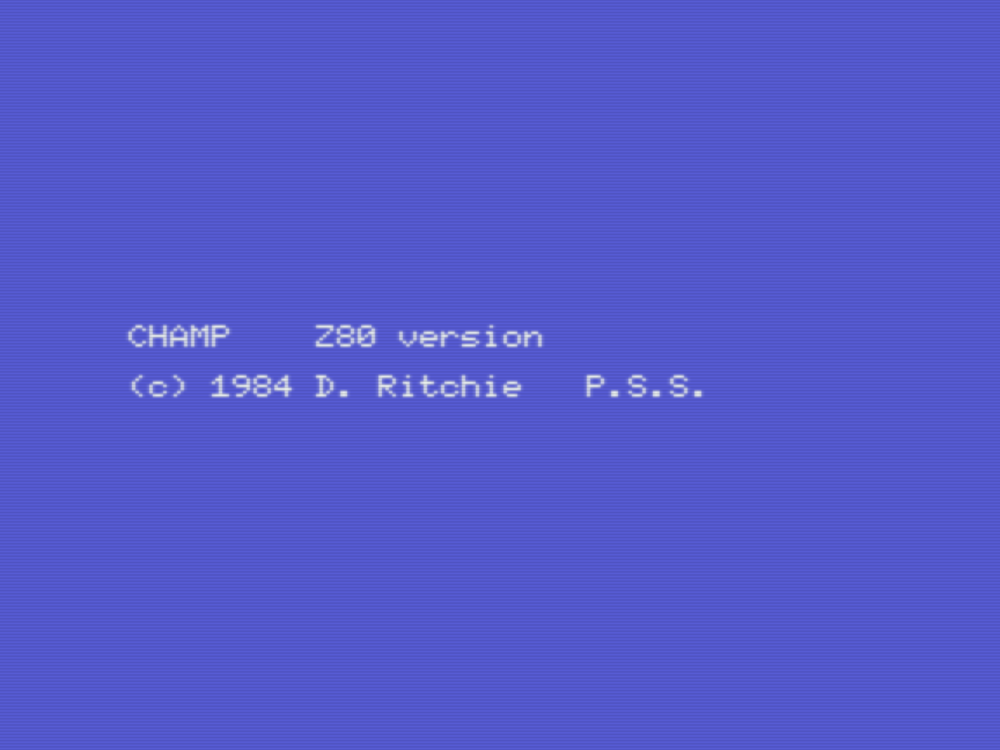
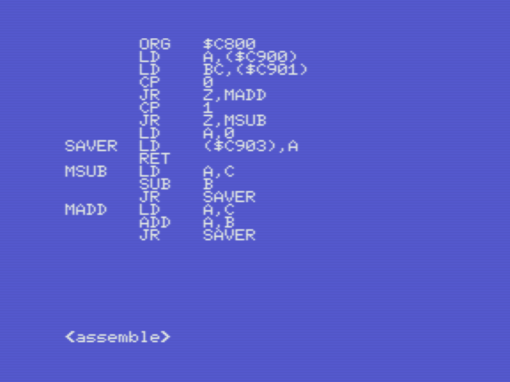
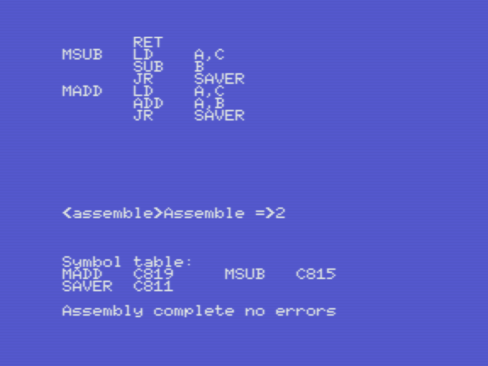
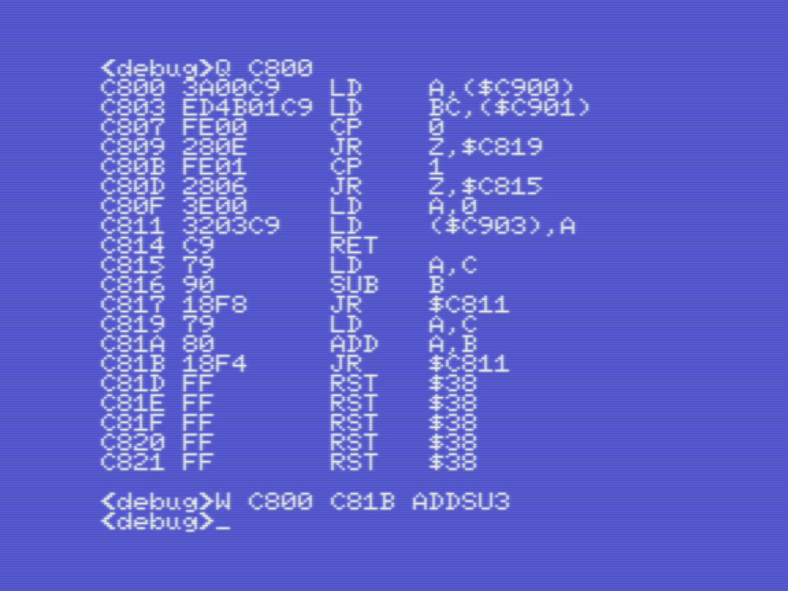
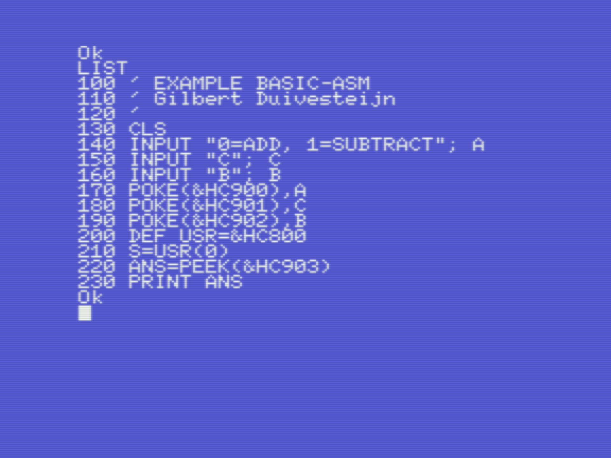
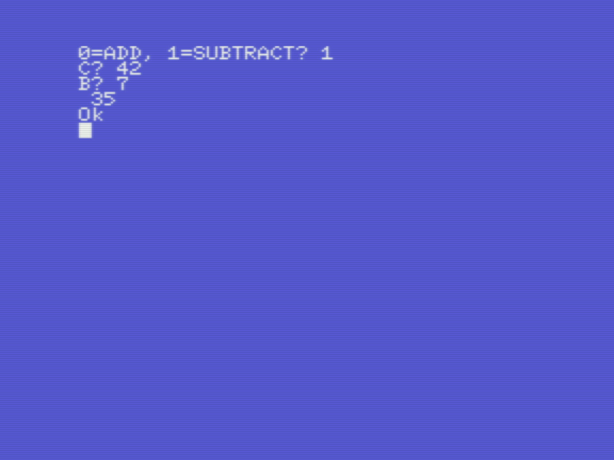
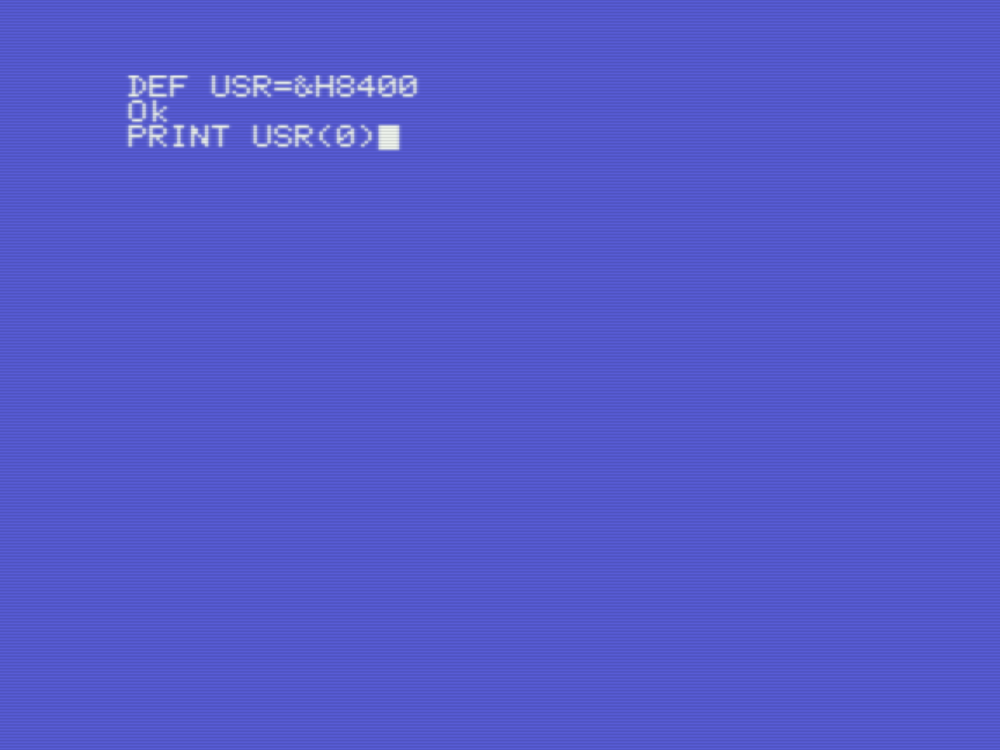

# Writing assembly for MSX with Champ

*Gilbert François Duivesteijn*

On this page, I try to explain how to use Champ for MSX(1) to write, store and deploy programs written in assembly or hybrid basic-assembly. Back in the days, around 1986 and beyond, I liked Champ a lot. It was easy to use, because it was an all-in-one editor, assembler, disassembler, monitor/debugger. On top of it, one could easily escape to basic to test the compiled program, which is still in memory and go back to Champ to do further programming. But the most killer feature was that you can step through code line by line, inspecting registers and memory values.

The aim of this page is not to be another ASM tutorial, but to show how you can develop and debug on a real MSX with only a cassette player/recorder as storage device, like it was done in the 80's with an MSX1 computer.

|                                   |                                     |
| :-------------------------------: | :---------------------------------: |
|  |  |
|         Box and cassette          |            Title screen             |

## Modes

Champ has 4 modes, Insert, Edit, Assemble and Debug. You can switch between the modes with the keys as described in the schema below.

---

 `< EDIT >`   &larr; `[ret]` &rarr;   `< INSERT >`

​          &uarr;

​     `[esc]`

​          &darr;

`< ASSEMBLE >`

                &uarr;

   `[m]`   `[a]`
 ​     &darr; 
   `< DEBUG >`

---
## Example 1: Assembler -> Basic -> Assembler roundtrip

 In this example, I loosly follow *Keith ChibiAkumas'* tutorial [Learn Z80 Assembly Lesson 3](https://www.youtube.com/watch?v=zPXmvoZz9Nk&list=PLp_QNRIYljFq-9nFiAUiAkRzAXfcZTBR_&index=3). We will make a small program in assembly that performs an add or subtract operation on single byte integers. We will make:

- Basic program that asks for the user input and shows the result.
- ASM program that computes and stores the result in memory.

 Please follow the steps below:

|                                                              |                                                              |
| ------------------------------------------------------------ | ------------------------------------------------------------ |
|                             |                             |
| 1) Use **insert** and **edit** to type in the example program. | 2) In **assemble** mode, type `a` `2` to compile. Save the listing as text to cassette with `s` -> `filename`. |
|                             |                             |
| 3) Go to **debug** mode by pressing `m`, view memory and disassembled code with `Q saddr`. If you want, you can store your finished binary to cassette with: `W saddr faddr filename`. | 4) Go back to assemble mode by pressing `a`. Go back to basic with `q` `y` and type in the listing above. |
|                             |                             |
| 5) If all is well, type `run` and see if your program works. | 6) You can go back to the Assembler by the commands above and edit/update your asm program. |

## Example 2: Assembler -> Run, Debug and Monitor

What makes Champ really powerful is that you are able to step through code and monitor the memory, stack, registers and program count. Let's go through a very simple example and step though the code line by line:

| Description | Screenshot |
| ----------- | ---------- |
|             |            |
|             |            |
|             |            |
|             |            |
|             |            |
|             |            |
|             |            |
|             |            |
|             |            |

## Commands and keybindings

### `<DEBUG>` mode commands

| Command | Effect |
| :----- | :----- |
| @*addr* | Memory from the given *addr* onwards displayed, one byte at the time, in hex and ascii equivalent. Hit (RET) to advance to next byte, hit (ESC) to return to command level, or type a hex constant to replace the existing content of the byte. |
| A | Return to `<Assemble>` mode. |
| D *addr* *faddr* | Memory from the given address onwards is displayed in screen pages: hit any key to continue, or (ESC) to return to command level. |
| F *saddr* *faddr* *hx* | Every byte between *saddr* and *faddr* is filled with *hx*. |
| K | Print source and symbol table usage. |
| M *daddr* *saddr* *faddr* | The block of memory between *saddr* and *faddr* is copied to the block starting at *daddr*. |
| Q *addr* | Memory from *addr* onwards is disassembled. Hit (RET) to continue and (ESC) to return to command level. |
| G *addr* | The code starting at *addr* is executed (returnable). |
| C *addr* | Execute from *addr* (non-returnable) |
| B*n*=*addr* | A breakpoint number n (between 1 and 8) is set at *addr*, to cause a break in execution of any program which accesses the contents of *addr* as an instruction. Press (C)(RET) to continue from breakpoint. |
| E*n* | Eliminates breakpoint *n*. |
| T | Display the addresses of all breakpoints. |
| R *regname* | Displays the contents of a CPU register and accepts a new value (similar to the function of @ above). |
| J *addr* | Executes the code from *addr* onwards, one instruction at the time, giving a full register display. Hit (J) to continue, (ESC) to return to the command level. |
| H *expr* | Displays the decimal, hex and binary value of expr. |
| S *bytestr* | Searches the memory from $0000 onwards for every occurance of bytestr. |
| N chstr | As `S` above. |
| W | Load, save and veryfy machine code to tape. |

Some notes:

- Champ has 3 columns: label, command, arguments.
- Press space if the line does not start with a label, to go to the next column.
- In edit mode, delete a line with `ctrl` `z`.
- Labels start with a letter, are max 6 characters long and have no `:` at the end.
- Hexadecimal addresses start with a `$`.
- Best ORG address $C000 (according to Champ).

## References

[Champ MSX Users Manual](./assets/doc/champ.pdf)

[Champ ZX Spectrum Users Manual](./assets/doc/champ_zxspectrum.pdf)

[Champ for ZX Spectrum](https://spectrumcomputing.co.uk/entry/8012/ZX-Spectrum/Champ)

[YouTube: Learn Multi platform Z80 Assembly Programming... ](https://www.youtube.com/watch?v=LpQCEwk2U9w&list=PLp_QNRIYljFq-9nFiAUiAkRzAXfcZTBR_)

[MSX Assembly Page, Grauw](http://map.grauw.nl)

[MSX Made Simple, Margaret Norman](https://www.elsevier.com/books/msx-made-simple/norman/978-0-434-98406-0)

[Practical MSX machine code programming, Steve Webb](https://archive.org/details/practical_msx_machine_code_programming_steve_webb)

